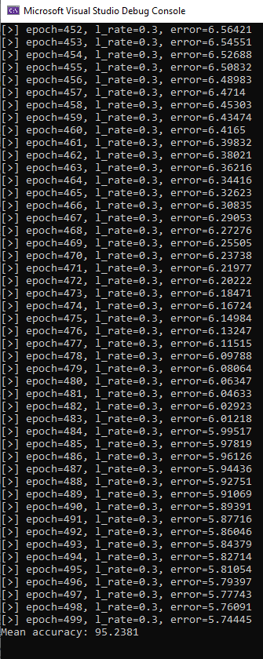

# Implementation of a Neural Network from Scratch in C++

> Only using the C++ STL (standard template library).

## Disclaimer

This was not my idea. I merely followed up on [this great tutorial](https://machinelearningmastery.com/implement-backpropagation-algorithm-scratch-python/), written by Jason Brownlee, where he explains the steps of programming a neural network from scratch in **Python** without the use of any library.

## Details

Porting the python code from Jason Brownlee to c++ is a great exercise to freshen up a bit on object oriented programming (using classes to represent neurons and layers) and vector handling. It also helps a great deal with understanding how neural networks work on the inside. However, there are many ways that a network like this can be build in c++ and I chose to dive into it without much planning. So the code might not be very beautiful, perfectly encapsulated or easy to comprehend (as a matter of fact, I know it isn't😔) but it was fun nevertheless.

## Compilation & Usage

This code was built in VisualStudio (2019 v16.9.4) with `g++ 8.1.0` (using C++14).

You can either import the code in an empty console project in VisualStudio or compile it directly on the command line with:

```
g++ -Wall -Wpedantic main.cpp NeuralNetwork.cpp
```
Simply running it will read the provided `csv` file from the same directory, train the network and attempt predictions afterwards. Based on the results of the predictions the accuracy is calculated and subsequently printed to `stdout`.

### Result

Using this network on the given seed dataset (and cross-validation) we are able to achieve an approximate accuracy of more than 90%.

The following result was achieved using a learning rate of 0.3 with 500 epochs and 5 neurons in the first hidden layer on a network with one hidden and one output layer.


